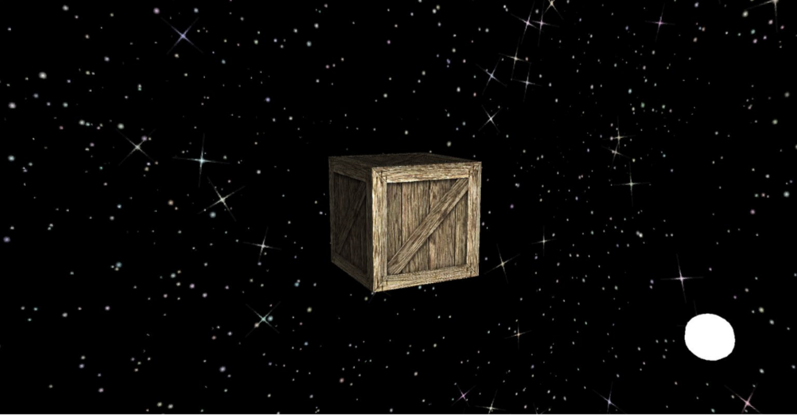

# CrateInSpace
openGl vertex and fragment shader implementation of a crate in space with phong and blinn refelction implementation

## Built With
* [giawa/opengl4csharp](https://github.com/giawa/opengl4csharp.git) - openGL C# binding
* [SDL](https://www.libsdl.org/) - cross-platform development library

## Textures
* [filterforge](https://www.filterforge.com/filters/9452.html) - crate (by jitspoe)
* [opengameart](https://opengameart.org/content/seamless-space-stars) - space / stars (by n4)
 